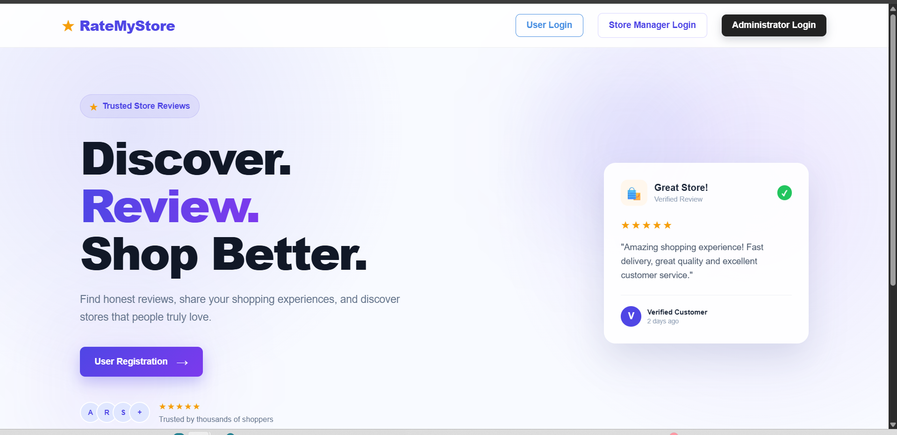
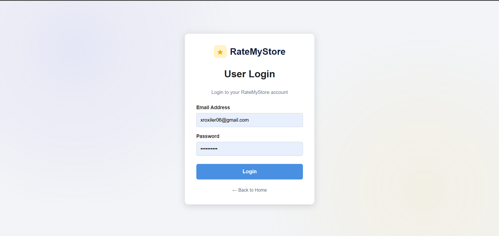
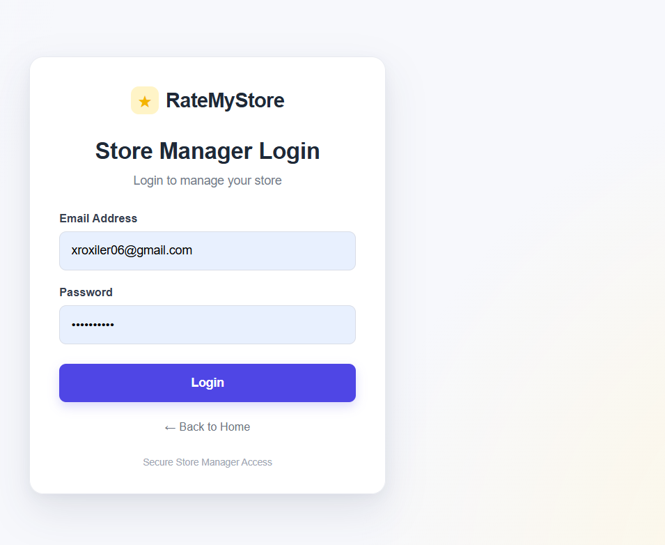
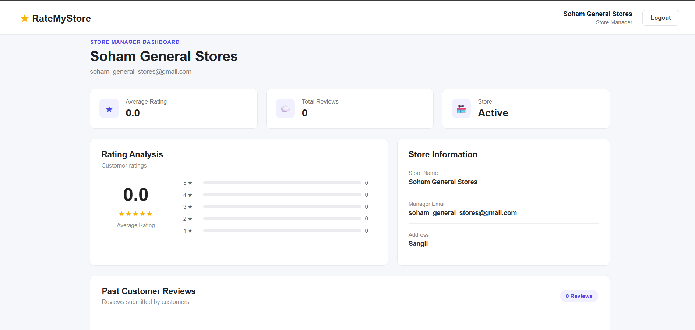
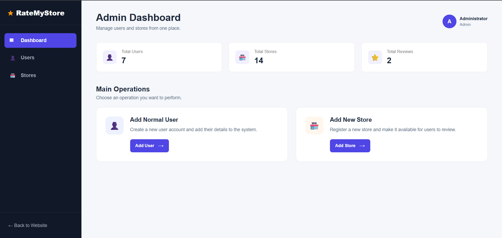
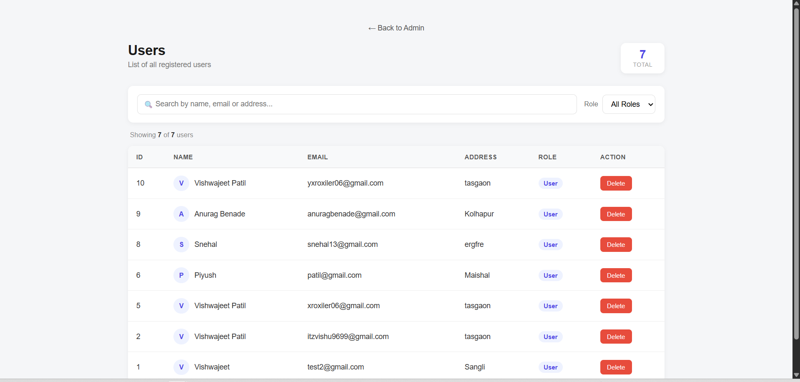
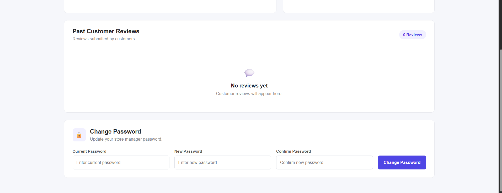

# ⭐ RateMyStore

A full-stack store rating and review platform where users can rate stores, store managers can track their store's performance, and admins can manage users and stores from a central dashboard.

## Features

- **Users** – register, log in, browse stores, and submit ratings
- **Store Managers** – view average rating, review count, rating breakdown, and change password
- **Admins** – dashboard with total users/stores/reviews, add/delete users, add/manage stores

## Tech Stack

- **Frontend:** React (Vite), React Router
- **Backend:** Node.js, Express
- **Database:** MySQL

## Project Structure

```
├── backend/       # Express server + MySQL connection
├── src/           # React components (pages for user/admin/store manager)
├── public/
└── package.json
```

## Setup

```bash
# install frontend deps
npm install

# install backend deps
cd backend
npm install
```

Create a `.env` file in `backend/`:

```env
DB_HOST=localhost
DB_USER=root
DB_PASSWORD=your_password
DB_NAME=xroxiler_db
PORT=5174
```

Run it:

```bash
# backend
cd backend
node server.js

# frontend (new terminal)
npm run dev
```

App runs at `http://localhost:5173`.

## Screenshots

<table>
<tr>
<td><b>Landing Page</b><br></td>
<td><b>User Login</b><br></td>
</tr>
<tr>
<td><b>Store Manager Login</b><br></td>
<td><b>Store Manager Dashboard</b><br></td>
</tr>
<tr>
<td><b>Admin Dashboard</b><br></td>
<td><b>Users Management</b><br></td>
</tr>
<tr>
<td><b>Stores Listing</b><br></td>
<td><b>Change Password</b><br></td>
</tr>
</table>

## Author

**Vishwajeet Patil**
