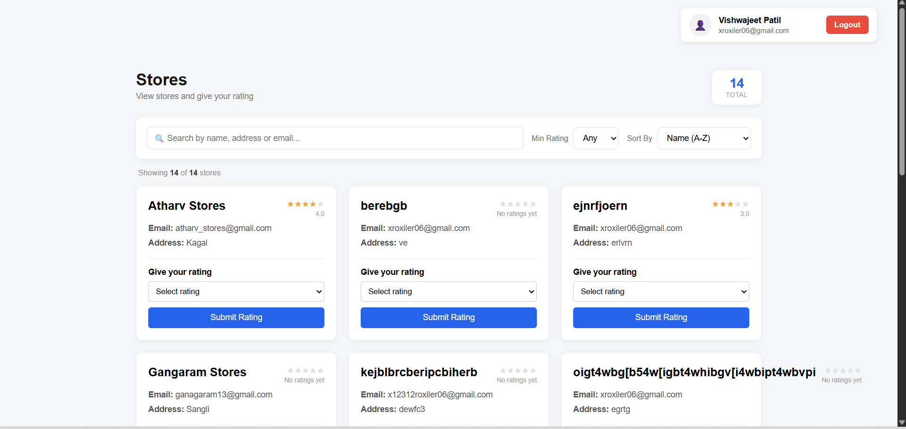

# ⭐ RateMyStore

A full-stack store rating and review platform where users can rate stores, store managers can track their store's performance, and admins can manage users and stores from a central dashboard.

## Features

- **Users** – register, log in, browse stores, and submit ratings
- **Store Managers** – view average rating, review count, rating breakdown, and change password
- **Admins** – dashboard with total users/stores/reviews, add/delete users, add/manage stores

## Tech Stack

- **Frontend:** React (Vite), React Router
- **Backend:** Node.js, Express
- **Database:** MySQL

## Project Structure

```
├── backend/       # Express server + MySQL connection
├── src/           # React components (pages for user/admin/store manager)
├── public/
└── package.json
```

## Setup

```bash
# install frontend deps
npm install

# install backend deps
cd backend
npm install
```

Create a `.env` file in `backend/`:

```env
DB_HOST=localhost
DB_USER=root
DB_PASSWORD=your_password
DB_NAME=xroxiler_db
PORT=5174
```

Run it:

```bash
# backend
cd backend
node server.js

# frontend (new terminal)
npm run dev
```

App runs at `http://localhost:5173`.

## Screenshots

| Landing Page | User Login |
|---|---|
|  |  |

| Store Manager Login | Store Manager Dashboard |
|---|---|
|  |  |

| Admin Dashboard | Users Management |
|---|---|
|  |  |

| Stores Listing | Change Password |
|---|---|
|  |  |

## Author

**Vishwajeet Patil**
